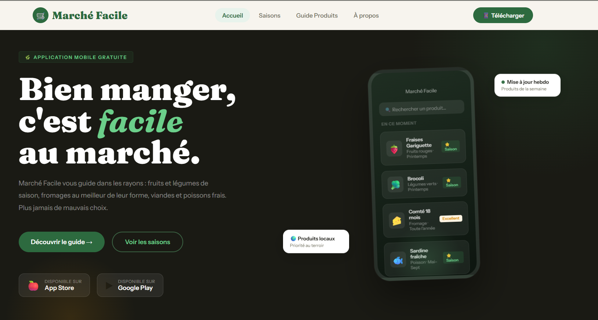

# Marché Facile

Marché Facile est une application web moderne conçue pour accompagner les utilisateurs dans leurs courses alimentaires du quotidien.  
L’application aide à choisir les meilleurs produits selon les saisons : fruits, légumes, fromages, viandes et poissons frais.

Le projet met en avant une expérience utilisateur fluide, un design responsive et une interface claire permettant de rechercher rapidement des produits, consulter des conseils de fraîcheur et découvrir les produits recommandés du moment.

Marché Facile propose également un calendrier saisonnier, des recommandations pratiques ainsi qu’un guide simple pour mieux consommer, éviter le gaspillage et privilégier les produits locaux et de saison.

Cette réalisation a été développée dans le but de pratiquer la création d’interfaces web modernes, l’intégration d’éléments visuels attractifs ainsi que l’optimisation de l’expérience utilisateur sur tous les appareils.

